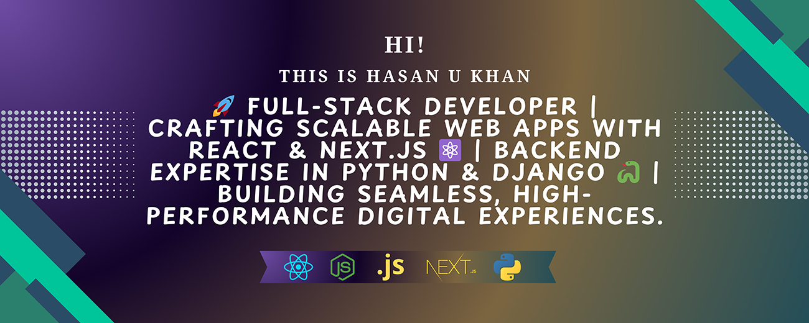

# Project Title

  
  

## Hey there 👋

Hi, I'm _Hasan U Khan_! 🚀 A full-stack developer passionate about building scalable web applications with Next.js, React, Express, MongoDB, Mongoose, Python, and Django.
My journey in web development started in 2015 while studying Computer Science & Engineering (CSE). Since then, I’ve been continuously sharpening my skills, exploring new technologies, and delivering high-quality websites for clients.
I specialize in writing clean, maintainable code and building reusable components, ensuring seamless scalability and easy future updates.

## 📝 About Me

I'm a passionate **Full-Stack Developer** who thrives on building scalable, high-performance applications and solving complex problems with modern technologies.

-🚀 **Always Evolving** – Continuously exploring new tools, frameworks, and best practices to stay ahead in the ever-changing tech landscape.

-💻 **Open-Source Contributor** – Actively engaging with the developer community and contributing to meaningful projects.

-⚡ **Tech Stack** – Skilled in **React, Next.js, Node.js, Python, and Django**, with a commitment to expanding my expertise.

## ⚔️ Skills & Expertise

---

### Connect with me

---

